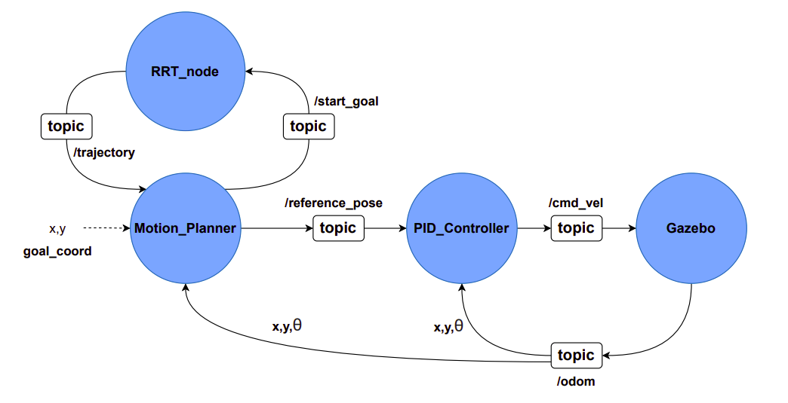

# autonomous-nav-stack

A full autonomous navigation stack built on ROS, integrating RRT path planning with closed-loop PID control to drive a TurtleBot3 through obstacle-filled environments — from goal input to robot arrival, end to end.

---

## Demo

Link: https://youtu.be/CP9u6fk73YQ

---

## What this is

This project ties together four core robotics components into a single working system:

- **Gazebo** — physics simulator that hosts the TurtleBot3 world and publishes `/odom` odometry feedback
- **RRT path planner** — finds a collision-free path through an occupancy grid map
- **Motion Planner** — the coordinator node that sequences waypoints and triggers planning
- **PID Controller** — drives the robot to each waypoint using odometry feedback

The result is a robot that you give a goal coordinate to, and it figures out how to get there on its own — planning, navigating, and correcting itself in a fully simulated 3D environment.

Built as part of an autonomous systems course (Spring 2026) using ROS Noetic + Gazebo + TurtleBot3.

---

## Repo structure
 
```
autonomous-nav-stack/
└── src/
    └── path_planning/
        └── src/
            ├── rrt.py               # RRT algorithm — tree expansion, collision checking, path extraction
            ├── rrt_node.py          # ROS node wrapper — subscribes to /start_goal, publishes /trajectory
            ├── motion_planner.py    # Central coordinator — sequences waypoints, monitors progress
            ├── pid_controller.py    # Closed-loop controller — drives robot to each waypoint
            ├── odom_plotter.py      # Rviz helper — subscribes to /odom and draws the robot's path
            └── odom_plotter.rviz    # Rviz config for the odometry visualization
```
 
---

## System architecture



**Topics at a glance:**

| Topic | Flow | What it carries |
|---|---|---|
| `/start_goal` | Motion Planner → RRT | Start + goal coords (x, y) |
| `/trajectory` | RRT → Motion Planner | Sequence of global (x, y) waypoints |
| `/reference_pose` | Motion Planner → PID | Next waypoint (x, y, θ, mode) |
| `/cmd_vel` | PID → Gazebo | Linear + angular velocity commands |
| `/odom` | Gazebo → Motion Planner, PID | Current robot pose from wheel encoders |

---

## How to run it

Each command runs in its own terminal. Source your workspace first in each one:

```bash
source ~/catkin_ws/devel/setup.bash
source ~/devel/setup.bash
export TURTLEBOT3_MODEL=burger
```

```bash
# Terminal 1 — Gazebo simulation
roslaunch turtlebot3_gazebo turtlebot3_world.launch

# Terminal 2 — Map server
rosrun map_server map_server /path/to/map.yaml

# Terminal 3 — RRT node
rosrun path_planning rrt_node.py

# Terminal 4 — PID controller
rosrun path_planning pid_controller.py

# Terminal 5 — Motion planner (enter goals here)
rosrun path_planning motion_planner.py

# Terminal 6 — Odometry plotter
rosrun path_planning odom_plotter.py

# Terminal 7 — Rviz
rviz -d /path/to/odom_plotter.rviz
```

Once the motion planner is running, type in a goal coordinate when prompted and watch it go.

---

## Stack

- ROS Noetic
- Python 3
- Gazebo
- TurtleBot3 (burger)
- Rviz

---

## Package setup

```bash
catkin_create_pkg path_planning rospy std_msgs geometry_msgs nav_msgs
```

All nodes live in `src/` and are registered in `CMakeLists.txt` via `catkin_install_python`.
